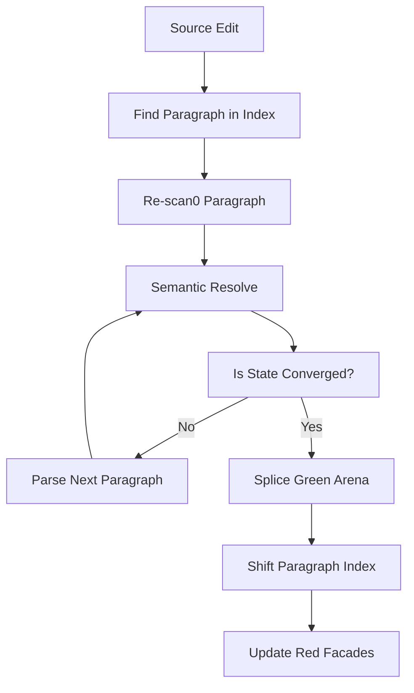

# Practical AST Implementation Plan

This document defines the high-level architecture and implementation steps for MixPad's Abstract Syntax Tree (AST). The design focuses on extreme memory efficiency and fast incremental updates while providing a stable, developer-friendly API for editors and UI components.

## 1. The Three-Layer Architecture

The system is split into three distinct layers to separate raw data from structural meaning.

1.  **Source String (Raw)**: The immutable text of the document. This is the single source of truth.
2.  **Green Arena (Structural Data)**: A dense, flat array of integers representing the tree structure. It contains no text, only relationships and relative sizes.
3.  **Red Facades (Logical API)**: Persistent JavaScript objects (classes) that wrap the Arena. These objects are what the developer interacts with.

## 2. The Green Arena (Physical Storage)

To avoid thousands of small object allocations, the structure is stored in a **Native JavaScript Array**.

### Node Layout
Every node in the Arena is a fixed-size header followed by optional materialized data:
-   **Header (ProvisionalToken)**: The Kind, Width, and Flags (packed 32-bit). This *is* the `ProvisionalToken` from the scanner.
-   **First Child**: The index in the Arena for the first child node (0 if none).
-   **Next Sibling**: The index in the Arena for the next sibling at the same level (0 if none).
-   **Materialized Data**: An optional slot for strings or objects (e.g., URIs, text content).

*Note: Nodes never store their Parent pointer. This intentional omission allows a "Green Node" to be reused even if its parent changes (e.g., after an edit higher up in the tree).*

### Relative-Only Geometry
Nodes **never** store their absolute position in the file. They only store their width. This allows an edit at the beginning of the file to have zero impact on the internal structural data of the rest of the document.

## 3. The Paragraph Index (The Coordinate Bridge)

The Paragraph Index is a separate, small array of absolute offsets where each paragraph begins. 

When a `BaseNode` needs to know its absolute position:
1. It identifies which paragraph it belongs to.
2. It gets the **Base Offset** from the Paragraph Index.
3. It traverses the "Green" siblings leading up to itself to add up their widths.

This keeps absolute position calculation fast ($O(1)$ for the paragraph, $O(N \text{ children})$ for the node) without polluting the Arena with fragile absolute numbers.

## 4. The Red Facade (Consumer API)

The `SourceFile` class coordinates the relationship between the string, the Arena, and the Facades.

### Persistent Identity
When a document is edited, the `SourceFile` compares the "fingerprint" of the old Green nodes with the new ones. If the Kind, Width, and Children remain identical, the **same** `BaseNode` object is reused. 
- This prevents UI flickering and allows downstream services (like Linters) to cache data for specific nodes safely across keystrokes.

### Entity-Affinitive Nodes
We only create nodes for significant semantic entities:
- **HeadingNode**: Represents the whole heading.
- **LinkNode**: Represents the link container.
- **CodeBlockNode**: Represents the fenced block.

Syntactic markers (the `#` in headings, the `[` in links) are **not** separate nodes. They are handled by lazy methods on the parent node class.

## 2. Diagram: The Reparse Intersection

## 5. Incremental Re-parsing Algorithm

When the user types a single character:

1.  **Identify Boundary**: Find the paragraph containing the edit using the `IsSafeReparsePoint` flag.
2.  **Local Re-parse**: Run the `scan0` and `semantic` scanners only on the affected text chunk.
### Convergence State Definition
Convergence is reached when the scanner state at a common `IsSafeReparsePoint` (e.g., a NewLine or Paragraph break) matches the state from the previous run.

A "State" includes:
1.  **Block Indentation Context**: Active block types (e.g., inside a List with 4 spaces or a Blockquote).
2.  **Speculative Parser State**: Flags for current speculatives (e.g., `isInSetextBufferMode`).
3.  **Delimiter Stack State**: The depth and current type of open delimiters (e.g., Emphasis, Link markers).
4.  **Error Recovery Mode**: Whether the scanner is currently recovering from a malformed sequence.

If all 4 match after re-parsing the changed section, the rest of the Arena can be safely re-used.

4.  **Arena Patching**: Use `array.splice()` on the Green Arena to replace only the modified nodes.
5.  **Index Shifting**: Add or subtract the character delta from the downstream entries in the Paragraph Index.

## 6. On-Demand Data Frugality

To keep the Arena as small as possible, we do not store "minute decoration" or "cheap details."

### The "Re-Scan" Principle
If a piece of information can be calculated in a few character peeks from the source string, we do not store it.
- **Heading Level**: A node method `getLevel()` starts at `node.pos` and counts `#` characters in the source string.
- **Fence Character**: A node method `getFenceChar()` simply returns `text[node.pos]`.

### The "Materialize" Exception
Information is only materialized (stored) in the Arena if:
- It is expensive to find (e.g., the language string of a code block which might require skipping specific whitespace patterns).
- It is needed for structural hierarchy (e.g., Link Destination).

## 7. Functional Blocks

### SourceFile
The root manager. Holds the `text`, the `arena`, and the `paragraphIndex`. It exposes methods like `getNodeAt(offset)` and `update(newText, changeSpan)`.

### SemanticProvider
A background service that can be plugged into the AST. It doesn't modify the tree but generates auxiliary "Symbol Maps" or "Diagnostics" using the persistent `BaseNode` IDs.

### Printer/Renderer
A fast visitor that walks the Green Arena directly. Because the Arena is a flat array, traversing it to generate HTML or Plain Text is extremely cache-friendly and faster than walking a traditional object-based tree.
